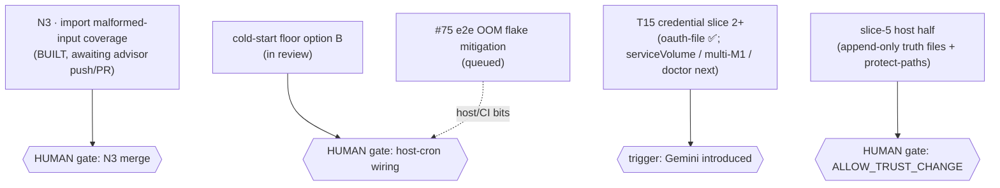

# Weekly report — 2026-W26 (Mon 2026-06-22 → Sun 2026-06-28)

> Generated 2026-06-23 via `/coordinate weekly` (P12). Numbers come from the
> named sources only: `docs/FR-registry.yml`, `docs/spec-map.md` (r4),
> `go test ./...`, `gh pr list`, `docs/auto-trial.md`, `docs/autopull-trial.md`,
> `.scratch/inbox/flips.log`. **First issue** — also the auto-trial day-7
> verdict carrier and the autopull Shape-1 day-2 checkpoint.

**Headline:** the security tier landed end-to-end this week — T20 egress
(none / allowlist-proxy) **and** ADR-0027 credentials (claude M1/M2 + the
Gemini `oauth-file` adapter) both shipped, the spec-map regenerated to **r4
(93 FRs, all tested)**, and the **author autopull Shape-1 trial went live**
(armed 2026-06-22T20:27Z). The long-standing "designed-but-unbuilt" gap on
The Run + Target Env is now **closed** — every workstream carries FRs.

---

## 1. Shape

The spec→FR→thread map is `docs/spec-map.md` (**r4**, regenerated 2026-06-23,
#274). It now carries the security tier (networking / credential / commands),
the autonomy `loop` node + 8 guards, the `start`/`import` sections, and a
**Workstream overlay**. **93 active FRs, all tested**; the only red surfaces
are the `update` and `export` verbs (0 FRs — spec-only).

---

## 2. Workstream coverage

The breadth lens (complements §6's depth lens). Source: `docs/FR-registry.yml`
family counts + the ADR set. **93 FRs / 27 ADRs (21 Accepted · 6 Proposed).**

| Workstream | FRs | FR families | ADRs (✅ Accepted · ⏳ Proposed) |
|---|---:|---|---|
| **The Spine** | 45 | BUILD 16 · SCHEMA 13 · EXEC 4 · ENTRY 4 · TEARDOWN 4 · PLAN 3 · DETECT 2 · SHELL 1 | 0001·02·04·06·08·11·12·15 ✅ · 0016 ⏳ |
| **AI-First** | 8 | INV 4 · LOOP 4 | 0005·0025 ✅ · 0020·0022 ⏳ |
| **The Run** | 8 | RUN 8 (start · emit-playbook · migrate) | 0014·0026·0027 ✅ |
| **Target Env** | 6 | IMPORT 6 (Stage-1 · features→tools · commands) | 0003·0007 ✅ |
| **Guardrails** | 16 | GUARD 8 · CRED 5 · NET 3 | 0021·0023·0028 ✅ · 0017·0018·0019 ⏳ |
| **Verification** | 8 | DOCTOR 6 · LOG 2 | 0010·0013 ✅ |
| **Dogfood** | 0 | — (governed by RULES/TEAM, not FRs) | 0009 ✅ |

**Gap-class signal — the DESIGNED-but-UNBUILT gap is CLOSED this week.** Last
issue's standing flag (The Run + Target Env held ADRs but few/zero FRs) is
resolved: The Run = 8 FRs, Target Env = 6 FRs (commands→tools #272 was the
final piece). **No workstream is now ADR-only.** The remaining frontier is the
**6 Proposed ADRs** — autonomy (0020/0022), trust (0017/0018), non-root (0019).

> ⚠️ `docs/WORKSTREAMS.md:97` still shows the stale **81-FR / #237-era** table
> (12 behind) and `docs/decisions/README.md` omits ADR-0023/0025. Flagged for a
> doc-currency fix (candidate batch-3 row B2, §8).

---

## 3. Confidence lens

**Gate-local suite (`go test ./...`, 2026-06-23): 12/12 packages green, 0 FAIL.**

| Package | Result | | Package | Result |
|---|---|---|---|---|
| audit | ✅ | | guard | ✅ |
| bootstrap | ✅ | | lock | ✅ |
| cli | ✅ | | playbook | ✅ |
| egress | ✅ | | render | ✅ |
| engine | ✅ | | resolver | ✅ |
| source | ✅ | | scripts | ✅ |

**FR coverage by tier (ADR-0013 — automated-only, no manual/waiver):** all 93
FRs carry a `tests:` joint and pass; coverage == total by construction. Split
by depth: the bulk run **gate-local** (unit/behavioral/invariant/guardrail/
schema); the docker-backed paths (build/exec/teardown/e2e-guards) prove on the
CI **integration tier** (~11 min, the live docker proof).

**Evidence freshness:** spec-map r4 (2026-06-23, fresh) · guided-run
(2026-06-11) · phase-1 review (2026-06-12) · self-wake live-verified
(2026-06-19) · credential adversarial security review CLEAN (2026-06-22, #252).

---

## 4. Shipped (W26 window, 24 PRs merged 06-22 → 06-23)

The week was the **security-tier + autonomy-substrate-exercise** arc.

**Guardrails — T20 egress & ADR-0027 credentials (the security tier):**
- #251 T20 S2b — egress allowlist via managed proxy sidecar (ADR-0028 A1)
- #252 ADR-0027 credential convention + claude M1/M2 adapters (slice 1)
- #254 T20/ADR-0027 hardening — doctor net-set precision, proxy timeouts, env-name charset
- #260 `oauth-file` credential adapter — Gemini OAuth/ADC (ADR-0027 slice 2)
- #256 strict decoding — reject unknown playbook keys (fail-loud typo guard)

**AI-First — autonomy substrate exercised + hardened:**
- #261 `/self-wake-off` skill — surgical disarm of the recurring waker
- #263 self-wake-doctor — read-only health check
- #265 hermeticEnv strips `LOOM_*` — gate env-independent (autopull hermeticity)
- #270 spawn-loop WAKEs only on an undelivered QUEUED envelope (kills the false-WAKE)

**Target Env — import maturation:**
- #257 capture devcontainer lifecycle commands as `reported` (not executed)
- #259 commands import mapping clause (declarative-only)
- #272 commands→tools deterministic mapping (N1)

**The autopull Shape-1 batch (author self-selected & built; advisor merged):**
- #264 E1 lighter guards-only e2e fixture · #268 E2 strict-decode table · #269 E3 non-execution proof
- #272 N1 commands→tools · #274 N2 spec-map r4 · **N3 built, awaiting merge** (the one open row)

**Dogfood/peer:** #255 gemini added as a peer agent in loom-dev (human-merged, security-posture).

---

## 5. Dependency graph (live rows)

Human-owned gates are diamonds. Nothing in the live band is code-blocked on
another agent — all four open rows wait on a **human/host action**, not a build.

---

## 6. Coverage map (FRs → tests → SPEC sections)

| SPEC surface | FRs | Coverage |
|---|---|---|
| build / schema / exec / entry / teardown | 41 | 🟢 all covered |
| detect / plan | 5 | 🟢 |
| doctor / log | 8 | 🟢 |
| run (start · emit · migrate) | 8 | 🟢 |
| import (Stage-1 · features→tools · commands) | 6 | 🟢 |
| networking / credential / commands (security tier) | 11 | 🟢 |
| autonomy loop + guards | 12 | 🟢 |
| invariants (--json / idempotent / observable / hermetic) | 4 | 🟢 |
| **`update` verb** | 0 | 🔴 spec-only, no FRs |
| **`export` verb** | 0 | 🔴 spec-only, no FRs |

No ADR-0013 violations (no FR lacks automated coverage). The only red is
**absence of FRs** on two declared verbs — backlog, not broken coverage.

---

## 7. EXPERIMENTS

| Name | Hypothesis | Telemetry | Status / verdict | Key numbers |
|---|---|---|---|---|
| **auto-trial (T22)** | acceptEdits→auto is safe for both seats | S1/S2/S3 vs baselines (advisor 2.2 would-prompt/turn, writer 2.5) | **keep** (zero S1+S2 over the window) | advisor auto since 2026-06-16; writer auto since 06-12 |
| **author autopull Shape-1 (ADR-0022)** | the author can self-select `[class:exec]` rows, drain, and build — bounded (cannot reach main) | S1 (never-floor exec / unintended main write / out-of-class select / BLOCKED-DEPS run) · S2 (gate-caught write / malformed drain / selection inversion) | **RUNNING — day 2 of 3** (armed 06-22T20:27Z) | 6/6 seeded rows built (E1·E2·E3·N1·N2 merged; N3 built); **0 S1, 0 S2 so far** |
| **self-wake (ADR-0022 shape A)** | an idle Writer can wake itself on deliverable work, zero-trust | live + test matrix; false-WAKE rate | **verified 2026-06-19**; false-WAKE bug fixed #270 | self-terminates on no undelivered QUEUED envelope |
| **cold-start continuity (P2 run 1)** | a cold session resumes from an injected checkpoint | scored rubric (docs/e2e/cold-start-continuity.md) | **5.5 / 6** | this session was checkpoint-injected at SessionStart |

---

## 8. Trial/ops + human to-do

**Autopull Shape-1 ledger (day 2):** `LOOM_AUTOPULL_CLASSES=exec` armed
2026-06-22T20:27Z (flips.log). Observations: author drained all 6 seeded
`[class:exec]` rows; 5 merged, N3 built-and-handed. **0 S1, 0 S2.** Rollback
(AUTOPILOT off / HALT) pre-authorized; not triggered. **Day-3 verdict due
2026-06-25** — keep/graduate-toward-Shape-2 iff zero S1+S2 holds.

**flips.log tail:** advisor off→on 2026-06-16 (session 17a3b602); trial-arm
2026-06-22T20:27Z.

**Human-owned to-do (deduplicated):**
| # | Item | Why it's human |
|---|---|---|
| 1 | **`loom.lock` decision** — fix-forward (re-pin Node-20) vs revert | lock currently resolves `nodejs v18.20.4` (apt) but `config/playbook.yml` requires NodeSource Node ≥20 for gemini-cli |
| 2 | **Merge N3** (last seeded autopull row) | merge gate (advisor-pushed, human-merged) |
| 3 | **Day-3 autopull verdict** (2026-06-25) | autonomy gate |
| 4 | **Seed batch-3 `[class:exec]` rows** before re-arming the author | autonomy / self-selection scope |
| 5 | **cold-floor host-cron wiring** (`0 * * * *` + auto-nudge inject) | host/topology |
| 6 | **slice-5 host half** — append-only truth files + relocate scripts under `config/hooks/` | ALLOW_TRUST_CHANGE |
| 7 | **`gh issue close 75`** | PAT lacks `issues:write` |

**Refresh prompts:** `/specmap` is current (r4). `/achievements` since last
run = §4. `docs/WORKSTREAMS.md` FR/ADR table is stale (81→93) — fold into a
batch-3 doc-currency row.
