# Spec map — threads overlaid on SPECs/FRs

> Generated 2026-06-23 (r4, autopull Shape-1 N2 regen) from `docs/FR-registry.yml` (`source:` joints, `tests:`
> coverage) and `docs/OPEN-THREADS.md` (status markers, `Pointers:` lines).
> Edge types are judgment calls, reviewed not parsed. Regenerate on ask
> (`/specmap`, sibling of `/achievements`).
>
> **Legend** — node fill: green = FRs present & covered (done) · yellow =
> spec live, implementation/FRs pending (in progress) · red = spec'd but
> untouched by implementation. Grey dashed nodes = threads (the "shadow"
> layer): ✅ resolved · 🟢 decided/in-build · 🟡 open. Edges: dotted =
> overlap / part-of · labeled ✕ = blocker / precursor. No edge = no spec
> relationship.

```mermaid
flowchart LR
  classDef done fill:#1a7f37,color:#fff,stroke:#0f5223
  classDef inprog fill:#bf8700,color:#fff,stroke:#7a5600
  classDef untouched fill:#cf222e,color:#fff,stroke:#82071e
  classDef shadow fill:#57606a,color:#ddd,stroke:#24292f,stroke-dasharray: 5 4

  subgraph SV["SPEC-verbs"]
    detect["detect (6 FR ✓)"]:::done
    plan["plan (3 FR ✓)"]:::done
    build["build (13 FR ✓)"]:::done
    exec["exec (4 FR ✓)"]:::done
    shell["shell (1 FR ✓)"]:::done
    teardown["teardown (4 FR ✓)"]:::done
    doctor["doctor (6 FR ✓)"]:::done
    logs["action+diag log (2 FR ✓)"]:::done
    bootstrap["entry: bootstrap (4 FR ✓)"]:::done
    start["start (4 FR ✓)"]:::done
    import["import (5 FR ✓)"]:::done
    update["update (spec'd, 0 FR)"]:::untouched
    export["export (later)"]:::untouched
  end

  subgraph SP["SPEC-playbook"]
    layers["layer resolution (4 FR ✓)"]:::done
    lock["lockfile (1 FR ✓)"]:::done
    basepb["base playbook (2 FR ✓)"]:::done
    frozen["frozen decisions (3 FR ✓)"]:::done
    harness["harness: incl. trust (4 FR ✓)"]:::done
    shellcfg["shell config model (1 FR ✓)"]:::done
    userf["user: field (3 FR ✓)"]:::done
    rolef["role: field (3 FR ✓)"]:::done
    net["networking: field (4 FR ✓)"]:::done
    cred["harness.credential (5 FR ✓)"]:::done
    cmds["commands mapping (1 FR ✓)"]:::done
  end

  subgraph RG["RULES §5 / guardrails / autonomy"]
    inv["AI-first invariants (4 FR ✓)"]:::done
    guards["guard hooks (8 FR ✓)"]:::done
    loop["autonomy loop (4 FR ✓)"]:::done
  end

  %% --- resolved threads (✅): dotted overlap with the section they closed ---
  T1T2["T1/T2 ✅ test doctrine"]:::shadow -.- inv
  T3["T3 🟢 FR seeding"]:::shadow -.- inv
  T4["T4 ✅ PATH owner (FR-BUILD-011)"]:::shadow -.- shellcfg
  T5["T5 ✅ lock fidelity"]:::shadow -.- lock
  T6["T6 ✅ dry-run mutation"]:::shadow -.- plan
  T7["T7 ✅ home re-sync"]:::shadow -.- build
  T8["T8 ✅ agents: install"]:::shadow -.- build
  T14["T14 ✅ creds survive rebuild"]:::shadow -.- cred
  T16["T16 ✅ harness home (ADR-0015)"]:::shadow -.- harness
  T19["T19 ✅ gate dep pin"]:::shadow -.- lock
  T29["T29 ✅ segment-aware guard"]:::shadow -.- guards
  T20["T20 ✅ egress proxy sidecar (ADR-0028)"]:::shadow -.- net
  T36["T36 ✅ The Run (start + detect)"]:::shadow -.- start
  T36 -.- detect
  T9["T9 🟢 entry verbs (exec+shell shipped)"]:::shadow -.- exec
  T9 -.- shell

  %% --- decided / in-build (🟢): labeled ✕ where a precursor is scheduled ---
  T10["T10 🟢 non-root (PR1/2 merged; PR3 run-as-user, PR4 role)"]:::shadow -->|"✕ user: = PR3"| userf
  T10 -->|"✕ role marker = PR4"| rolef
  T15["T15 🟢 AI-auth (ADR-0027 slice 1 #252)"]:::shadow -.- cred
  T37["T37 🟢 import (Stage-1 + commands→tools)"]:::shadow -.- import
  T37 -.- cmds
  T30["T30 🟢 auto-pull next ready"]:::shadow -.- loop
  T27["T27 🟢 autopilot control (facet A substrate)"]:::shadow -.- loop
  T31["T31 🟢 cold-floor liveness"]:::shadow -.- loop
  T33["T33 🟢 ephemeral fleet (ADR-0025)"]:::shadow -.- loop
  T33 -.- guards
  T12["T12 🟢 single dev container"]:::shadow -->|"✕ topology"| build

  %% --- open (🟡) ---
  T18["T18 🟡 multi-agent perms"]:::shadow -->|"✕"| harness
  T28["T28 🟡 harness self-defense"]:::shadow -.- guards
  T28 -->|"✕ strict-decode hardening"| frozen
  T28 -->|"✕ trust-source digest"| lock
```

## Workstream overlay (see docs/WORKSTREAMS.md)
The diagram's subgraphs align with the project workstreams — this overlay names the
mapping so the spec-map doubles as a per-stream coverage view. Full FR/ADR index:
`docs/WORKSTREAMS.md`.

- **SV (SPEC-verbs)** → **The Spine** — detect/plan/build/exec/shell/teardown/doctor/
  bootstrap (+ the red `update`/`export` backlog). `start` → **The Run**; `import` →
  **Target Env**; `logs` + `doctor` *serve* **Verification**.
- **SP (SPEC-playbook)** → **The Spine** schema, now with a **security tier**:
  `networking:` (T20 → **Guardrails**), `harness.credential` (T15 → **The Run**),
  `commands mapping` (T37 → **Target Env**), plus `user:`/`role:` (T10).
- **RG (RULES §5 / guardrails / autonomy)** → `inv` → **AI-First**; `guards` →
  **Guardrails**; the new `loop` node (FR-LOOP-001..004) → **AI-First/Dogfood** (the
  autonomy substrate, ADR-0020/0022).
- **Threads by stream**: T20/T28/T33 → Guardrails · T10 → Guardrails + The Spine ·
  T15 → The Run (creds) · T36 → The Run · T37 → Target Env · T18 → AI-First/Dogfood ·
  T27/T30/T31 → autonomy loop · T12/T34 → Target Env (topology).

## No spec shadow (by design or gap?)

Governance / process / host-infra threads with no SPEC/FR projection: `T17`
activity scripts · `T21` transport (mechanism shipped — drain + inbox) · `T22`
auto-trial · `T23` AUTOPILOT scoping · `T24` /achievements · `T25` context
economy · `T26` rollback recommendation · `T32` supervising-box (host cron home) ·
`T34` advisor-in-loom (siting/topology).

Standing question each regeneration: which graduate from TEAM.md/host convention to
spec? **This regen answers one outright** — the autonomy substrate (T27/T30/T33) *did*
graduate: it now casts a real FR shadow (the `loop` node + the spawn-rate/reaper
guards), the first time the dogfood-autonomy work crossed into tested contract. The
next candidate is T27's wake verb (`loom poke`) — still host-side (`ScheduleWakeup` +
cron), enters SPEC-verbs only if it lands engine-side.

## Reading the shape

- **The yellow band is empty — the spine is built.** Every live spec section is
  green (FRs present & tested); only `update` and `export` stay red, honest Phase-2+
  backlog. **93 active FRs, all tested** — ADR-0013's automated-only doctrine still
  holding at 4× the r3 count (54 → 93).
- **SPEC-playbook grew a whole security tier.** Three threads each became a contract
  *section*, not just an edge: `networking:` (T20 / ADR-0028 — the egress proxy
  sidecar), `harness.credential` (T15 / ADR-0027 slice 1), `commands mapping` (T37 /
  #259 — declarative-only). r3 noted T28→lock as "the first time a security thread
  drove a contract"; that is now the norm, not the exception.
- **Autonomy crossed from convention into mechanism.** The new `loop` node and the
  guard family's growth (4 → 8: + resurface, e2e, spawn-rate, reaper) anchor what was
  pure dogfood in r3. T27/T30/T31/T33 finally cast an FR shadow — the self-wake/drain
  substrate is tested contract now, the engine of this very N2 regen.
- **Target Env + The Run filled the 0-FR gap r3 flagged.** `import` (5 FR, T37 🟢) and
  `start` (4 FR, T36 ✅) plus `detect`'s growth (the RUN FRs) mean the two streams the
  r3 map called "invisible by design = the gap" now carry coverage. The gap closed.
- **The waiting edges resolved.** r3's "two edges wake on the trial verdict" (T20
  egress, T15 auth) both **shipped**. T10 narrowed from an open question to two
  scheduled PRs (run-as-user PR3, role marker PR4).
- **Header-rot flag for the audit**: T9 and T21 markers still lag reality (both
  effectively done/proven); the map renders ground-truth markers, so they read stale
  here by design — the fix belongs in OPEN-THREADS, not here (→ `/replan` or a report).
