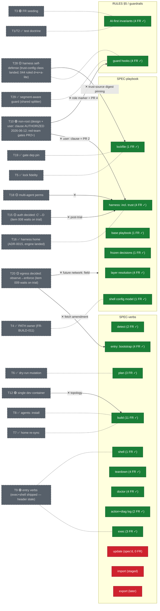

# Spec map — threads overlaid on SPECs/FRs

> Generated 2026-06-12 (r3, post drain-proof evening) from `docs/FR-registry.yml` (`source:` joints, `tests:`
> coverage) and `docs/OPEN-THREADS.md` (status markers, `Pointers:` lines).
> Edge types are judgment calls, reviewed not parsed. Regenerate on ask
> (`/specmap`, sibling of `/achievements`).
>
> **Legend** — node fill: green = FRs present & covered (done) · yellow =
> spec live, implementation/FRs pending (in progress) · red = spec'd but
> untouched by implementation. Grey dashed nodes = threads (the "shadow"
> layer): ✅ resolved · 🟢 decided/in-build · 🟡 open. Edges: dotted =
> overlap / part-of · labeled ✕ = blocker / precursor. No edge = no spec
> relationship.

## Workstream overlay (see docs/WORKSTREAMS.md)
The diagram's subgraphs already align with the project workstreams — this overlay
names the mapping so the spec-map doubles as a per-stream coverage view. Full FR/ADR
index: `docs/WORKSTREAMS.md`.

- **SV (SPEC-verbs)** → **The Spine** — detect/plan/build/exec/shell/teardown/doctor/
  bootstrap (+ the red `update`/`import`/`export` backlog). `logs` → **Verification**
  (observability); `doctor` is a Spine verb that *serves* Verification.
- **SP (SPEC-playbook)** → **The Spine** — layers/lock/basepb/frozen/harness/shellcfg.
- **RG (RULES §5 / guardrails)** → `inv` (AI-first invariants) → **AI-First**;
  `guards` → **Guardrails**.
- **Threads by stream**: T20/T28 → Guardrails · T10 → Guardrails + The Spine ·
  T15 → The Run (creds) · T18 → AI-First/Dogfood (multi-agent perms) ·
  T12 → Target Env (topology).
- **Invisible here BY DESIGN = the coverage signal**: **The Run** and **Target Env**
  hold ADRs but **zero FRs** (designed-not-built), and **Dogfood** lives in RULES/TEAM
  — so they cast no spec shadow. Their absence from this map *is* the gap (see
  WORKSTREAMS.md "FR/ADR coverage").

⚑ The diagram's FR counts are STALE (e.g. `build` shows 11, registry has 17; `doctor`
4 vs 6) — a `/specmap` regen is due; the stream overlay above is the durable lens.

## No spec shadow (by design or gap?)

`T21` transport (mechanism PROVEN live 2026-06-12 — header still says "in
build") · `T22` auto-trial · `T23` AUTOPILOT scoping · `T24` /achievements ·
`T25` context economy · `T26` rollback recommendation · `T27` autopilot
control+observability (phase-1 watchdog→page queued) · `T17` activity
scripts — governance/process threads with no SPEC/FR projection. Standing
question each regeneration: which graduate from TEAM.md convention to spec?
T21 remains the likeliest (proven mechanism, outgrowing dogfood); T27's
wake verb (`loom poke`) is a new candidate — if it lands engine-side it
enters SPEC-verbs.

## Reading the shape

- **The yellow band cleared today**: r2's two in-progress nodes both went
  green — `harness:` finished its engine work (#86/#87/#107) and grew the
  trust clause + materialization (#113, FR-BUILD-013/014, FR-SCHEMA-008);
  `shell` shipped (#85, FR-SHELL-001). A new green section appeared:
  `shell config model` (T4, FR-BUILD-011). The spine is now **54 active
  FRs, all tested** — ADR-0013's automated-only doctrine still holding.
- **Red is honest backlog**: `update`, `import`, `export` — spec'd verbs
  with no implementation claim, Phase 2+ scope.
- **The guard family is the active frontier**: guards grew to 4 FRs
  (T29's segment-aware evaluation + the trust-config protect class), and
  T28's ruled mechanism (044 = build-time digest pinning) points at the
  **lockfile** — trust-source digests join what the lockfile pins, the
  first time a security thread has driven a contract section.
- **T10 is no longer the undecided blocker**: design drafted, SPEC
  `user:` clause human-authorized 2026-06-12 (adv-048); advisor red-team
  gates PR 2+. Its two edges (harness materialization, guard role marker)
  are now scheduled work, not questions.
- **Two edges still wake on the trial verdict (2026-06-18)**: T20 egress
  and T15 auth envelopes self-promote at the verdict.
- **Header-rot flag for the audit**: T9 and T21 markers lag reality (both
  effectively done/proven); the map renders ground-truth markers, so they
  read stale here by design — the fix belongs in OPEN-THREADS.
