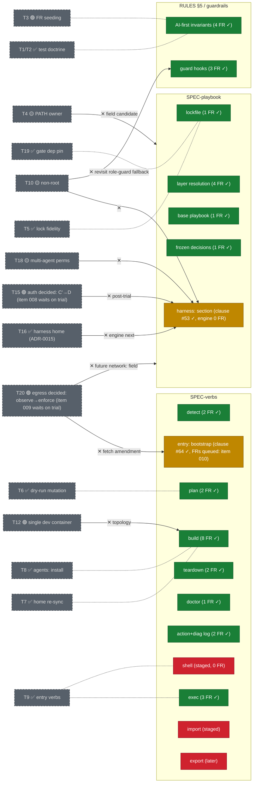

# Spec map — threads overlaid on SPECs/FRs

> Generated 2026-06-11 (r2, post trial-flip) from `docs/FR-registry.yml` (`source:` joints, `tests:`
> coverage) and `docs/OPEN-THREADS.md` (status markers, `Pointers:` lines).
> Edge types are judgment calls, reviewed not parsed. Regenerate on ask
> (recurrence candidate: `/specmap`, sibling of `/achievements`).
>
> **Legend** — node fill: green = FRs present & covered (done) · yellow =
> spec live, implementation/FRs pending (in progress) · red = spec'd but
> untouched by implementation. Grey dashed nodes = threads (the "shadow"
> layer): ✅ resolved · 🟢 decided/in-build · 🟡 open. Edges: dotted =
> overlap / part-of · labeled ✕ = blocker / precursor. No edge = no spec
> relationship.

## No spec shadow (by design or gap?)

`T21` transport · `T22` auto-trial · `T23` AUTOPILOT scoping · `T24`
/achievements · `T17` activity scripts — governance/process threads with no
SPEC/FR projection. Standing question the map raises each regeneration:
should any of these graduate from TEAM.md convention to spec (T21's
transport is the likeliest candidate once it outgrows dogfood).

## Reading the shape

- **The spine is green**: every built verb and every playbook schema section
  has covered FRs — 41 FRs, all `active`, all with tests (ADR-0013's
  automated-only doctrine holding).
- **The yellow band is the live frontier**: `harness:` (clause accepted,
  T16 engine work queued next) and `entry: bootstrap` (clause accepted +
  conformance-fixed #64; FR extraction dispatched, inbox item 010).
- **Red = declared, not started**: `shell` (staged behind T16), `import`/
  `export` (Phase 2+). Red here is honest backlog, not neglect.
- **The frontier's gates are now decisions, not questions**: T20
  (observe→enforce) and T15 (C′→D) were both decided 2026-06-11; their
  build envelopes (items 009/008) self-promote at the trial verdict
  (2026-06-18). T10 non-root remains the only undecided blocker on the
  map; T18 folds into the harness: engine work.
- **Trial note**: the auto-trial went LIVE 2026-06-11 — still castless
  on this map (governance), but its verdict is the wake-signal for two
  of the edges above.
